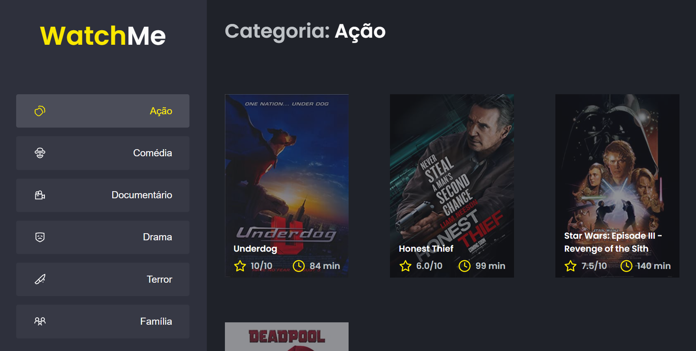
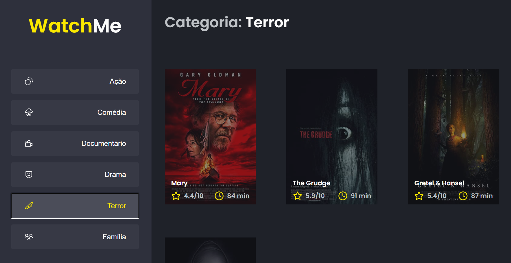

  <h1>:rocket: Watch-Me  </h1>
  <h2>Desafio complementar Ignite Trilha React</h2>
  
Desafio complementar proposto na trilha de React do Ignite da Rocketseat, neste desafio foi solicitado que aplicassemos o que aprendemos com relação a criação de Hooks, utilizando em conjunto uma FakeAPI do JSON Server.

  
Não foi possivel realizar o deploy deste projeto devido a necessidade da utilização da FakeAPI com o JSON Server.

## Atividades propostas

- [x] Criar um Hook e Aplicar a lógica de funcionamento no mesmo.
- [x] Refatorar as informações dentro do App.tsx para o seus respectivos componentes.

## Extras

- [x] Fake API com JSON Server

<h3>Tela Principal</h3>

A aplicação se resume a apenas uma tela, dividida apenas em Content e SideBar, ao clicar nos botões na SideBar a aplicação irá retornar as informações condizentes com o botão do tema clicado. Ao criar a comunicação entre estes dois components foi utilizado o TypeScript para a passsagem de dados entre haja com um determinado padrão, sendo assim impossibilitando a passagem de informações inválidas.

## Giving feedback

Feedback é sempre bem-vindo, se você tiver qualquer sugestão ou duvida por favor me enviar um e-mail: gcgonzalez99@hotmail.com
